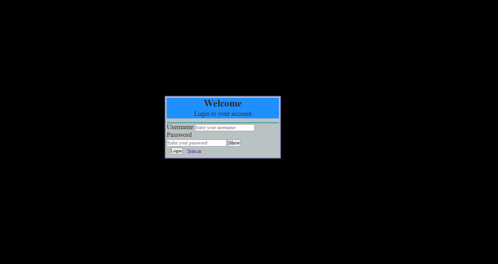
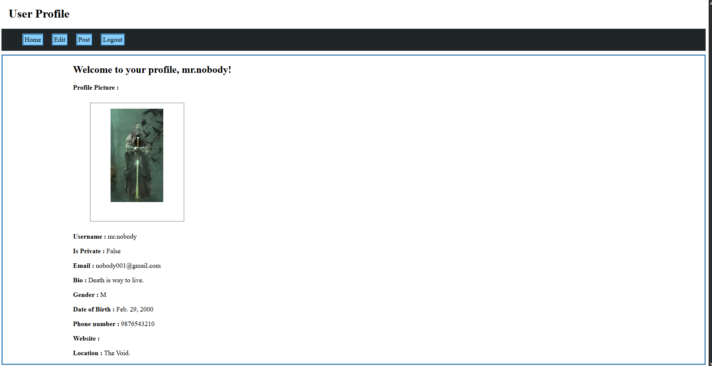
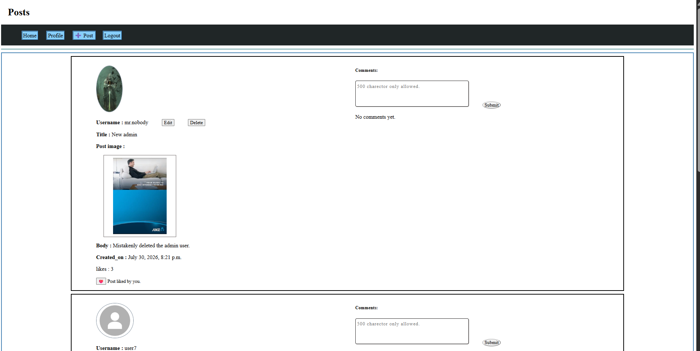
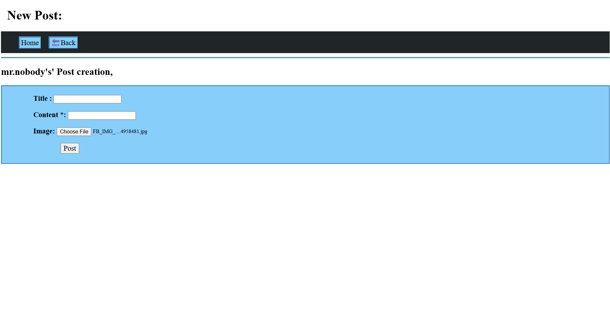

# Django Social Media Platform

Current Version: **v1.0** 


A Django-based social media web application that allows authenticated users to create and manage posts, interact through comments and likes, and maintain their personal profiles.

## Table of Contents

- [Overview](#-overview)
- [Features](#-features)
- [Screenshots](#️-screenshots)
- [Technology Stack](#️-technology-stack)
- [Project Structure](#-project-structure)
- [Application Architecture](#-application-architecture)
- [Database](#️-database)
- [Installation](#️-installation)
- [Application Flow](#-application-flow)
- [Media Uploads](#-media-uploads)
- [Current Limitations](#-current-limitations)
- [Future Enhancements](#-future-enhancements)
- [Documentation](#-documentation)
- [Requirements](#-requirements)
- [Project Status](#-project-status)
- [Author](#-author)

## 🎯 Overview

The Django Social Media Platform is a web application developed using Django. It provides user authentication, profile management, post creation, image uploads, comments, and likes.

The project follows Django's Model-View-Template (MVT) architecture and uses Django's built-in authentication system together with custom Profile, Post, Comment, and Like models.


## 🚀 Features

### User Authentication

* User registration
* User login and authentication
* User logout
* Authentication-protected pages
* Django's built-in password validation
* Password change form

### User Profile

* Automatically creates a Profile when a new User is registered
* One-to-one relationship between User and Profile
* Profile picture
* Bio
* Gender
* Date of birth
* Phone number
* Location
* Website
* Private account option
* Profile editing
* Custom date-of-birth validation

### Posts

* Create posts
* Optional post title
* Post content
* Optional image upload
* View posts in reverse chronological order
* Edit own posts
* Delete own posts
* Display edited status and modification time

### Comments

* Add comments to posts
* Display comments under their associated posts
* Delete own comments

### Likes

* Like posts
* Unlike posts
* Display the total number of likes
* Display whether the current user has liked a post

### Access Control

* Login is required for protected pages and post operations
* Users can edit and delete only their own posts
* Users can delete only their own comments

## 🛠️ Technology Stack

* **Python**
* **Django 6.0.7**
* **SQLite**
* **HTML**
* **CSS**
* **Django Templates**
* **Django ORM**
* **Django Authentication System**


## 🖼️ Screenshots

### Login


### Profile


### Posts


### Create Post


## 📁 Project Structure

```text
Social-Media-Platform/
│
├── social_platform/
│   ├── settings.py
│   ├── urls.py
│   ├── asgi.py
│   └── wsgi.py
│
├── users/
│   ├── migrations/
│   ├── templates/
│   ├── admin.py
│   ├── apps.py
│   ├── form.py
│   ├── models.py
│   ├── signal.py
│   ├── urls.py
│   └── views.py
│
├── posts/
│   ├── migrations/
│   ├── templates/
│   ├── admin.py
│   ├── apps.py
│   ├── forms.py
│   ├── models.py
│   ├── urls.py
│   └── views.py
│
├── friends/
│   
│
├── templates/
├── static/
├── media/
├── db.sqlite3
├── manage.py
├── requirements.txt
└── .gitignore
```

## 🏢 Application Architecture

The project follows Django's Model-View-Template architecture.

```text
Browser
   ↓
URL
   ↓
View
   ↓
Form / Validation
   ↓
Model
   ↓
Database
   ↓
Model
   ↓
View
   ↓
Template
   ↓
Browser
```

### Users Application

The `users` application handles:

* Registration
* Login and logout
* User profile
* Profile editing
* Password management
* User/Profile forms
* Automatic Profile creation through a Django signal

A Django `User` has a one-to-one relationship with a `Profile`.

### Posts Application

The `posts` application handles:

* Post creation
* Post editing
* Post deletion
* Comments
* Comment deletion
* Likes and unlikes
* Post image uploads
* Post listing

The application uses separate models for posts, comments, and likes.

## 🗃️ Database

The project currently uses SQLite for development.

The main data relationships are:

```text
User
 │
 └── One-to-One ── Profile
 │
 ├── One-to-Many ── UserPost
 │
 ├── One-to-Many ── UserComment
 │
 └── One-to-Many ── UserLike

Post
 ├── One-to-Many ── UserComment
 └── One-to-Many ── UserLike
```

A Profile is automatically created when a new Django User is created.

## ⚙️ Installation

### 1. Clone the repository

```bash
git clone https://github.com/AJRobees/Social-Media-Platform.git
cd Social-Media-Platform
```

### 2. Create a virtual environment

```bash
python -m venv .venv
```

### 3. Activate the virtual environment

**Windows:**

```bash
.venv\Scripts\activate
```

### 4. Install dependencies

```bash
pip install -r requirements.txt
```

### 5. Apply migrations

```bash
python manage.py migrate
```

### 6. Run the development server

```bash
python manage.py runserver
```

Open the development server address shown in the terminal in a web browser.

## ⏳ Application Flow

A typical user flow is:

```text
Register
   ↓
User created
   ↓
Profile automatically created
   ↓
Login
   ↓
Home
   ↓
Posts
   ├── Create Post
   ├── Edit Post
   ├── Delete Post
   ├── Like / Unlike
   └── Comment
```

The current Home page is a placeholder for a future friend-based feed. Users currently access the available posts through the Posts page.

## 📷 Media Uploads

The application supports image uploads for:

* Profile pictures
* Post images

Uploaded media is handled through Django's media configuration during development.

## 📉 Current Limitations

The following features were part of the planned project scope but are **not currently implemented**:

* Friends / friend-request system
* Friend-based Home feed
* Notifications
* WebSocket-based notifications
* REST API
* Automated tests

The `friends` component is retained for future development.

## 🔮 Future Enhancements

Possible future improvements include:

* Implementing the friends and relationship system
* Building a personalized Home feed based on friends
* Adding real-time notifications using WebSockets
* Developing REST API endpoints
* Adding automated unit and integration tests
* Improving the frontend design and responsiveness
* Adding additional privacy and interaction controls

## 📄 Documentation

Detailed documentation for this project is divided into:

* **User Manual** — explains how to use the application and its available features.
* **Project Documentation** — explains the project's architecture, database design, application flow, implementation details, and development decisions.

## 🛒 Requirements

The project currently uses:

```text
Django==6.0.7
```
The complete dependency list is available in `requirements.txt`.

## 📌 Project Status

**Current status:** Core social media functionality implemented.

The current version provides authentication, profile management, posts, comments, likes, and image uploads. Additional social networking and backend features remain planned for future development.

## 👨‍💻 Author

**Antony John Robees. A**

Python Developer | Backend Developer | Computer Science Graduate

GitHub: [AJRobees](https://github.com/AJRobees)